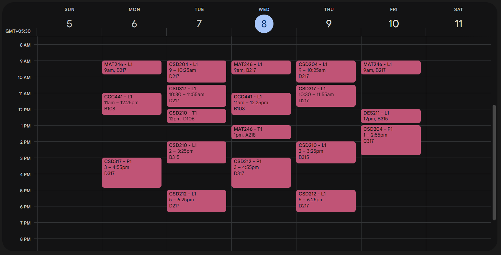

# UniSync 🗓️

UniSync is an automation tool that seamlessly syncs your SNU course schedule with Google Calendar.

# Features
- **Automated Schedule Extraction:** Securely authenticates and scrapes weekly schedule from SNU's ERP
- **Google Calendar Integration:** Creates and updates events using the Google Calendar API
- **Seamless Integration:** Keep your schedule organized with just a few clicks

# Security
Sensitive information like NetId and Password as well your Google Credentials are only stored in `.env` files and are only accessed to authenticate with SNU's ERP and Google OAuth respectively.

Other sensitive information used to persist sessions and calendars are stored under the `secrets/` directory. This directory is only ever accessed to authenticate with the Google API's.

# Example
### On Google Calendar


### In Terminal
```bash
$ D:/devEnv/projects/UniSync/.venv/Scripts/python.exe d:/devEnv/projects/UniSync/src/main.py

DevTools listening on ...
[Scraping ERP Data] |█████████████████████████| 100.00%
[Formatting Schedule] |█████████████████████████| 100.00%
[Clearing Existing Events] |█████████████████████████| 100.00%
[Creating Monday Events] |█████████████████████████| 100.00%
[Creating Tuesday Events] |█████████████████████████| 100.00%
[Creating Wednesday Events] |█████████████████████████| 100.00%
[Creating Thursday Events] |█████████████████████████| 100.00%
[Creating Friday Events] |█████████████████████████| 100.00%
Successful
```

# Setup
1. Clone this respository and navigate into it.
```bash
git clone https:://github.com/lalitm1004/UniSync.git
cd UniSync
```
2. Go onto Google Cloud Console and create a Project (name whatever)
3. Configure your OAuth Consent scren (email me for help)
    - Add `./auth/calendar` to your scopes
4. Goto credentials and make an OAuth Client ID
    - Select `Web Application` (name whatever)
    - Under `Authorized redirect URIs` add `http://localhost/`
    - Save the credential and copy your Google ClientID and ClientSecret
5. Create a `.env` file and populate it like shown in `.env.exampple`
6. Run `pip install -r requirements.txt` (setup an venv if required).
7. Run `python src/main.py`

# Usage
Just run this script at the start of each week to synchronize your schedule. Enjoy!